<div align="center">

# Rewriting the Narrative
### *Evaluating Machine Translation in African Languages with Corrected FLORES Data*


<h4>Ennis Maphasha | Itumeleng Moshokoa | Bukhosi Eugene Mpande</h4>

**Group 24** 
# 
</div>
<div align="center">
*"Every language is a world. Without translation, we would inhabit parishes bordering on silence."* - George Steiner
</div>

## Table of Contents

- [Overview](#overview)
- [Dataset Sources](#dataset-sources)
- [Translation Models Evaluated](#translation-models-evaluated)
- [Evaluation Metrics](#evaluation-metrics)
- [Required Packages](#required-packages)
- [Running the code](#running-the-code)
- [Project Structure](#project-structure)
- [Results](#results)
## Overview

> **Breaking Down Language Barriers**: While the original FLORES benchmark provided an important step toward evaluating MT systems for under-represented languages, it contained linguistic inaccuracies that risked skewing model evaluations. In response, corrected versions of the dataset were developed to enhance accuracy and consistency. This study investigates how these corrections influence the evaluation of modern MT models in terms of accuracy, fairness, and reliability.

### The evaluation Pipeline

```mermaid
graph TD
    A[🌐 English Text]
    C[🏗️ African Languages]
    D[📊 Evaluation Metrics]
    D --> E[📈 Performance Analysis]
    E --> F[💡 Insights & Discoveries]
    
    A --> G[NLLB-200 400M 🧠]
    A --> H[NLLB-200 1.3B 🧠]
    A --> I[M2M100 418M 🔄]
    A --> J[M2M100 1.2B 🔄]
    A --> K[OPUS-MT Sotho 🎯]
    A --> L[OPUS-MT Hausa 🎯]
    G --> C
    H --> C
    I --> C
    J --> C
    K --> C
    L --> C
    C --> M[FLORES101 🌍]
    C --> N[FLORES200 🎯 ]
    C --> O[FLORES + 🚀]
    C --> P[FLORESFIX4AFRICA 💨]
    M --> D
    N --> D
    O --> D
    P --> D    
```


## Dataset sources

This project utilizes the following datasets:

#### [FLORES-101](https://huggingface.co/datasets/gsarti/flores_101)
A large-scale multilingual dataset covering 101 languages, with parallel texts for machine translation evaluation and low-resource language research.

#### [FLORES-200](https://huggingface.co/datasets/facebook/flores)
An expanded version of the FLORES dataset covering 200 languages, providing broader language coverage including many extremely low-resource languages not included in FLORES-101.

#### [FLORES+](https://huggingface.co/datasets/openlanguagedata/flores_plus)
**Enhanced FLORES dataset**  
An improved version of the original FLORES dataset with additional quality refinements and potentially expanded content.

#### [FLORES-Fix-For-Africa](https://github.com/dsfsi/flores-fix-4-africa)
**African language corrections for FLORES**  
A specialized version of FLORES with corrections and improvements focused on African languages to address specific challenges in these language varieties.

## Translation Models Evaluated  

This project evaluates the following translation models: 

####  [NLLB-distilled-200 (600M)](https://huggingface.co/facebook/nllb-200-distilled-600M)
> 600M parameters
> -  200 languages supported
> -  Optimized for speed and quality ( "distilled" )

####  [NLLB-distilled-200 (1.3B)](https://huggingface.co/facebook/nllb-200-distilled-1.3B)
> 1.3B parameters
> -  Superior quality for complex texts
> -  Better handling of nuanced expressions
> -  Flagship model

####  [M2M100 (418M)](https://huggingface.co/facebook/m2m100_418M)
> 418M parameters
> -  Direct translation (no English pivot)
> -  100 languages connected
> -  Many-to-many approach

####  [M2M100 (1.2B)](https://huggingface.co/facebook/m2m100_1.2B)
> 1.2B parameters
> -  Direct translation (no English pivot)
> -  Enhanced performance across all pairs
> -  Better context understanding

####  [OPUS-MT-EN-NSO](https://huggingface.co/Helsinki-NLP/opus-mt-en-nso)
> Fine-tuned for Northern Sotho


####  [OPUS-MT-EN-HA](https://huggingface.co/Helsinki-NLP/opus-mt-en-ha)
> Fine-tuned for Hausa

## Evaluation Metrics
### **BLEU Score**
> Bilingual Evaluation Understudy
> -  N-gram precision matching

### **chrF Score**  
> Character n-gram F-score
> -  Character-level precision
> -  Better for morphologically rich languages
> -  Captures subtle differences

### **BERTScore**
> Contextual embedding similarity
> -  Semantic similarity focus
> -  Neural network powered
> -  Understands meaning, not just words

### **COMET (AfriCOMET-MTL)**
> **The African Specialist**: Neural metric trained for African languages
> -  Specifically designed for African languages
> -  Cultural and linguistic awareness

# Running the Code
## Required Packages
```bash
# The essentials for African language translation evaluation
pip install datasets transformers torch sacrebleu tqdm numpy regex accelerate
pip install bert-score sentence-transformers unbabel-comet sacremoses
pip install huggingface_hub pandas matplotlib seaborn
```
> <span style="color: red">**Note:**</span> Ensure that if using Google Colab, **Colab Pro** instances are used to avoid excessive runtimes.

1. To get started go to our **[Official github](https://github.com/bukhosi-eugene-mpande/nlp-project)**.

2. Install the required packages
    ```python
        !pip install -r requirements.txt
    ```
3. Run the evaluation script
    ```python
        !python evaluation.py
    ```
4. Accessing the results
    - The script generates a ZIP file containing all translations, metrics, and visualizations
    - You can download this file from the Colab file browser

## Project Structure
```bash
nlp-project/
├── evaluation.py        # Main evaluation script
├── flores101/           # FLORES-101 dataset files
├── flores200/           # FLORES-200 dataset files
├── floresplus/          # FLORES+ dataset files  
├── floresfixforafrica/  # FLORES-Fix-For-Africa dataset files
├── translations/        # Generated translations
│   ├── m2m100_418M/
│   ├── m2m100_1.2B/
│   ├── nllb-200-distilled-600M/
│   ├── nllb-200-distilled-1.3B/
│   ├── opus-mt-en-ha/
│   └── opus-mt-en-nso/
├── metrics/             # Calculated metrics
└── visualizations/      # Generated visualizations
```
## Results

Our evaluation generated comprehensive visualizations across multiple dimensions of the translation task. Click on each section to explore the detailed results.

<details>
<summary><b><span style="font-size: 1.2em;">Comprehensive Dashboard</span></b></summary>

### Overall Evaluation Dashboard

</details>

<details>
<summary><b><span style="font-size: 1.2em;">Model Comparison by Metric</span></b></summary>

### BLEU Score Comparison


### chrF Score Comparison


### BERTScore Comparison


### COMET Score Comparison

</details>


<details>
<summary><b><span style="font-size: 1.2em;">Dataset Comparison</span></b></summary>

### NLLB-200-distilled-1.3B Dataset Performance


### NLLB-200-distilled-600M Dataset Performance


### M2M100 418M Dataset Performance


### M2M100 1.2B Dataset Performance

</details>

<details>
<summary><b><span style="font-size: 1.2em;">Error Analysis</span></b></summary>

### Missing Words Error Distribution


### Extra Words Error Distribution


</details>

<details>
<summary><b><span style="font-size: 1.2em;">FLORES101 Error Analysis</span></b></summary>

### FLORES101 Missing Words Error Distribution

### FLORES101 Extra Words Error Distribution

</details>

<details>
<summary><b><span style="font-size: 1.2em;">FLORES200 Error Analysis</span></b></summary>

### FLORES200 Missing Words Error Distribution

### FLORES200 Extra Words Error Distribution

</details>

<details>
<summary><b><span style="font-size: 1.2em;">FLORES+ Error Analysis</span></b></summary>

### FLORES+ Missing Words Error Distribution

### FLORES+ Extra Words Error Distribution

</details>

<details>
<summary><b><span style="font-size: 1.2em;">FLORESFIX4AFRICA Error Analysis</span></b></summary>

### FLORESFIX4AFRICA Missing Words Error Distribution

### FLORESFIX4AFRICA Extra Words Error Distribution

</details>

